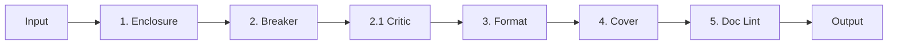

# FIX-4 Pipeline Specification

## 📋 Overview
FIX-4는 NABERAL 프로젝트의 핵심 파이프라인으로, 전기 패널 견적 생성의 전체 프로세스를 관리합니다.

## 🔄 Pipeline Flow



## 📊 Stage Specifications

### Stage 1: Enclosure (외함 계산)

**목적**: 최적의 외함 크기 및 사양 결정

**입력**:
- 장치 수량 및 크기
- IP 등급 요구사항
- 환경 조건

**처리**:
```python
def calculate_enclosure(spec):
    # 1. 필요 공간 계산
    required_space = calculate_space_requirements(spec.devices)

    # 2. IP 등급 결정
    ip_rating = determine_ip_rating(spec.environment)

    # 3. SKU 매칭
    sku = match_sku(required_space, ip_rating)

    # 4. Fit score 계산
    fit_score = calculate_fit_score(sku, spec)

    return EnclosureResult(sku, fit_score)
```

**출력**:
- 선택된 SKU
- Fit score (≥ 0.90)
- 치수 및 사양

**검증**:
- ✅ fit_score ≥ 0.90
- ✅ IP rating ≥ 44
- ✅ 도어 여유 ≥ 30mm

### Stage 2: Breaker (브레이커 배치)

**목적**: 브레이커 최적 배치 및 상평형

**입력**:
- 브레이커 리스트
- 외함 치수
- 열 제약사항

**처리**:
```python
def place_breakers(breakers, panel):
    # 1. CP-SAT 솔버 초기화
    model = cp_model.CpModel()

    # 2. 변수 정의
    positions = define_position_variables(breakers, panel)

    # 3. 제약조건 추가
    add_phase_balance_constraints(model, breakers)
    add_thermal_constraints(model, breakers, panel)
    add_clearance_constraints(model, positions)

    # 4. 최적화 실행
    solver = cp_model.CpSolver()
    status = solver.Solve(model)

    return PlacementResult(positions, phase_balance)
```

**출력**:
- 배치 좌표
- 상평형 수치
- 열 분포도

**검증**:
- ✅ 상평형 ≤ 3-5%
- ✅ 간섭 위반 = 0
- ✅ 열 위반 = 0

### Stage 2.1: Critic (비평 및 검증)

**목적**: 배치 결과 검증 및 개선 제안

**입력**:
- 배치 결과
- 비즈니스 규칙

**처리**:
```python
def critique_placement(placement):
    violations = []
    warnings = []

    # 1. 상평형 검사
    if placement.phase_imbalance > MAX_IMBALANCE:
        violations.append("Phase imbalance exceeded")

    # 2. 열 분포 검사
    if placement.max_row_heat > MAX_ROW_HEAT:
        violations.append("Thermal violation")

    # 3. 간격 검사
    if placement.clearance_violations > 0:
        violations.append("Clearance violation")

    return CriticResult(violations, warnings, recommendations)
```

**출력**:
- 위반 사항
- 경고 사항
- 개선 권장사항

### Stage 3: Format (문서 포맷팅)

**목적**: 표준 양식으로 문서 생성

**입력**:
- 계산 결과
- 템플릿

**처리**:
- Excel 템플릿 적용
- 데이터 주입
- 수식 보존

**출력**:
- 포맷된 견적서
- Excel/PDF 파일

**검증**:
- ✅ 문서 린트 = 0
- ✅ 네임드 범위 손상 = 0

### Stage 4: Cover (표지 생성)

**목적**: 표준 표지 및 메타데이터 생성

**입력**:
- 프로젝트 정보
- 고객 정보

**처리**:
- 표지 템플릿 적용
- 메타데이터 삽입

**출력**:
- 완성된 표지
- 목차

**검증**:
- ✅ 표지 규칙 = 100%

### Stage 5: Doc Lint (문서 검증)

**목적**: 최종 문서 품질 검증

**입력**:
- 완성된 문서

**처리**:
```python
def lint_document(doc):
    errors = []

    # 1. 구조 검사
    check_document_structure(doc)

    # 2. 데이터 일관성
    check_data_consistency(doc)

    # 3. 표준 준수
    check_standards_compliance(doc)

    return LintResult(errors)
```

**출력**:
- 린트 결과
- 오류 목록

**검증**:
- ✅ 린트 오류 = 0

## 📊 Performance Metrics

| Stage | Target Time | Max Time | Success Rate |
|-------|------------|----------|--------------|
| Enclosure | < 500ms | 1s | ≥ 99% |
| Breaker | < 1s | 30s | ≥ 99% |
| Critic | < 200ms | 500ms | 100% |
| Format | < 2s | 5s | ≥ 99% |
| Cover | < 500ms | 1s | 100% |
| Doc Lint | < 300ms | 1s | 100% |

## 🔗 Integration Points

### Input Sources:
- User Interface
- API Endpoints
- Import Files (Excel, DXF)

### Output Targets:
- File System
- Database
- Email
- Cloud Storage

## 📈 Evidence Collection

각 단계별 증거 수집:
```
/evidence/{timestamp}/{stage}/
├── input.json       # 입력 데이터
├── output.json      # 출력 결과
├── metrics.json     # 성능 지표
├── validation.json  # 검증 결과
└── visual.{svg|png} # 시각화
```

## ⚠️ Error Handling

### Retry Policy:
- Max retries: 3
- Backoff: Exponential
- Timeout: 30s per stage

### Fallback Strategy:
- OR-Tools 실패 시 → Heuristic 알고리즘
- Template 없음 → 기본 템플릿
- 검증 실패 → 수동 검토

## 🔐 Security Considerations

- 입력 검증 필수
- 민감 정보 마스킹
- 감사 로그 기록
- 접근 권한 확인

---
*Version: 1.0*
*Date: 2024-12-29*
*Status: Active*